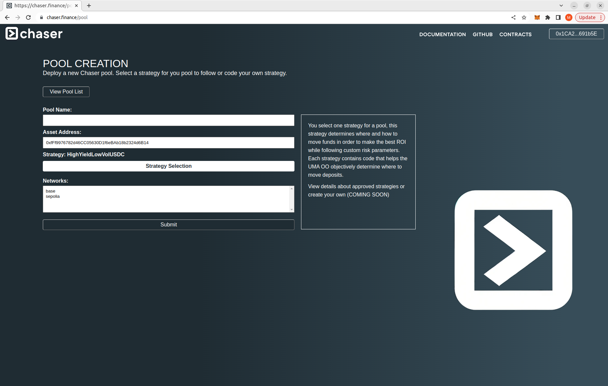
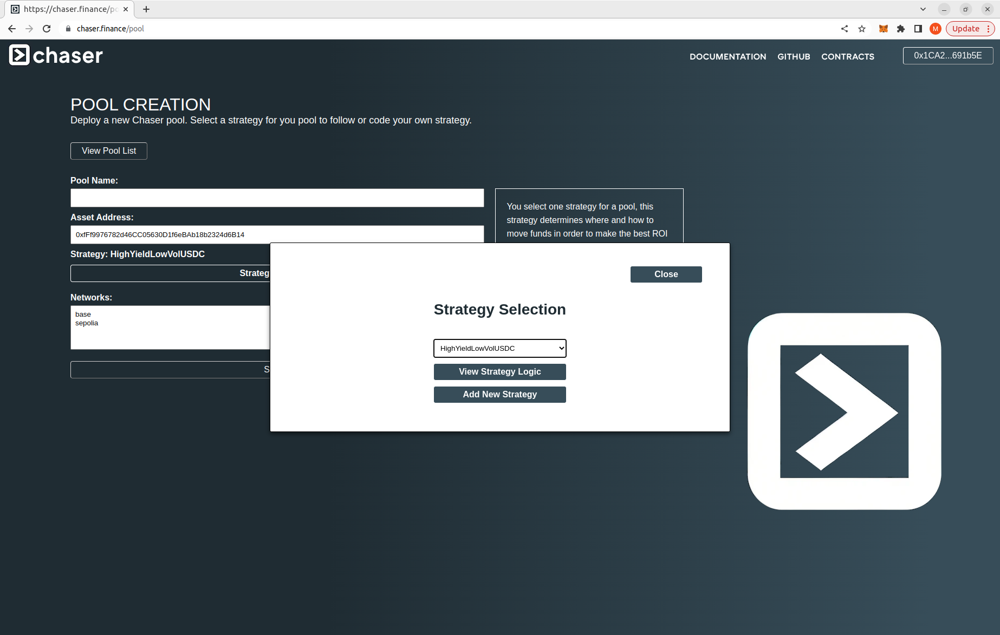
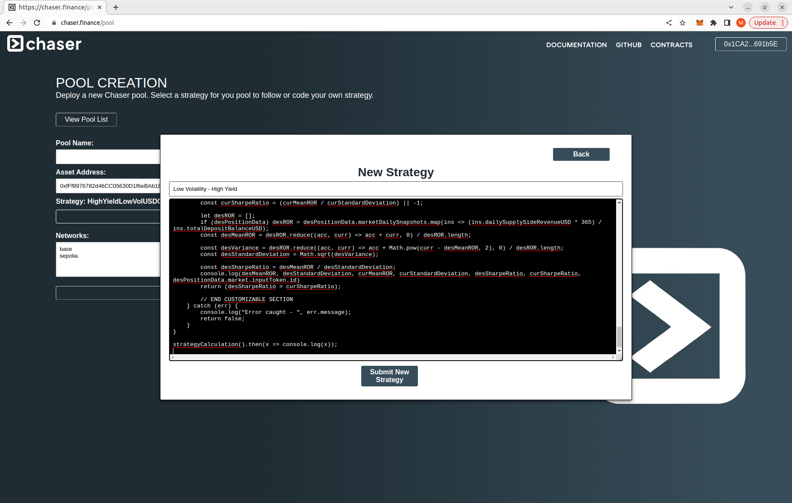
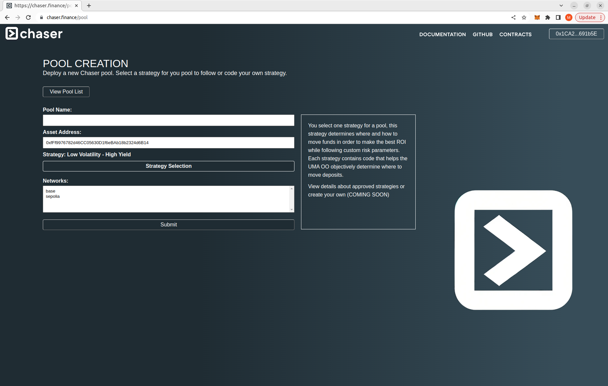

# Chaser

Chaser revolutionizes DeFi investing by empowering users to create data based investment strategies on chain. With granular subgraph data on various DeFi protocols, Chaser pools generate optimal yield while gaining deep control over risk. Factoring in historical and positional subgraph data, Chaser opens up impossible investment strategies like:  

- Deposit WETH into the lending protocol with the lowest 30 day volatility
- Any stablecoin market on Aave that has consistently yielded above 5% in the last year
- Move funds to the best Aave market with no borrows worth +10% of TVL
- Invest into the lending protocol with highest daily volume

After defining the ideal, metric based investment, Chaser will move pool deposits in between different protocols and networks as market conditions change. By calculating these strategies on chain, DAOs and other decentralized protocols can enhance liquidity utilization and maximize returns while setting their own desired risk parameters. 

By routing deposits to lending protocols like Aave and Compound, revenue is made from reliable, time-tested sources. Chaser is built on top of the Across Bridge for cross-chain transactions, Chainlink CCIP for cross-network state management, and the UMA Oracle for automating investment movements. This architecture simplifies the process for DAOs and end users by managing all aspects of cross-chain and cross-protocol routing.

## How does Chaser improve DeFi?

Imagine using the below statstics from Aave/Compound/Spark/etc to determine exactly how your DAO's unused liquidity can be invested:

- Daily market volumes, revenues, opened positions, yields
- Granular data on all open positions
- Protocol wide data, comparisons between cooresponding markets on different networks

Without this kind of data, DeFi investment strategies are very limited. Only current state is available on contracts. There is also a lack of indexed, calculated metrics such as open position balances or user counts. While a single EOA could run a bot off chain, DAOs do not have the luxury of centralizing these determinations. 

Chaser makes it possible to factor all of this in into your DAOs liquidity management. By deploying a pool and defining a strategy script, Chaser moves your funds efficiently while following your desired risk parameters. 

### Example: USDC yields directly in Aave/Compound vs Chaser 

As an example, here are the 90 day APYs for USDC deposits on 8 different Aave and Compound deployments. 

- Aave Arbitrum: 9.85%
- Aave Base: 6.03%
- Aave Ethereum: 8.85%
- Aave Optimism: 9.44%
- Aave Polygon: 10.23%
- Compound Ethereum: 9.39%
- Compound Arbitrum: 8.04%
- Compound Polygon: 10.19%

But if you were to deposit your funds into a Chaser pool using a strategy that seeks the highest yield at that given moment, your 90 day APY would be:

- Chaser: 13.53%

## How does Chaser investing work?

Chaser's architecture uses a pool system. Each pool defines a strategy on how and when funds should be moved (see more on this below).
Beyond depositing and withdrawing funds, Chaser handles all of the complexities of entering and exiting investment positions on external protocols behind the scenes. 

It is important to keep in mind that when a pool has an investment position on a different network, there are delays when finalizing your interactions. Specifically, deposits to other chains need to bridge and send a callback message before minting pool tokens. Also, withdraws from positions on other chains face similar delays. The current idea of the Chaser token is to facilitate instant liquidity for pools with positions on other chains. If there is an open proposal to move the pools funds, there is a block on deposits and withdraws to prevent funds lost when bridging gets executed.

## Tutorials

Chaser is live on Sepolia: [chaser.finance](https://chaser.finance/) 

### Moving Pool Funds

### Strategies

Chaser strategies are based on custom written Javascript logic that query subgraph data and analyze metrics on a market. Each proposal to move deposits on a Chaser pool requires a user submit a protocol name, network and market ID that points to a market entity on the Messari subgraph for that protocol. The proposal generates a node command that UMA Oracle disputers execute in order to verify that this proposal would be a better investment for the defined strategy. This is determined by executing the Javascript logic and receiving `true` as the return value. When a pool is deployed, the strategy is set and unchangeable.

It is best to write a strategy using the template in `strategyTemplate.js`. Here are some of the rules for creating Chaser strategies:

- The maximum file size is 24kb
- Declare each supported chain and asset addresses supported on each chain in the `supportedChainsAssets` object.
- Perform your numerical analysis/comparison on any metric listed in the subgraph query. Any metric you do not end up using for your strategy's analysis, feel free to remove from the query
- In the custom logic section, write any sorts of validations and checks you want to perform to prevent a pool from pivoting deposits
- In the case of an error querying or executing logic, return false and do not let the pool pivot
- After processing the subgraph data, make some sort of condition to return true and declare that the pool should pivot deposits to the proposed market
- The query pulls data snapshots of the given market every day for the last year and a market entity that gets the current state of these metrics.

Soon, these strategies will be based off of executing logic held in a Github repo. This will allow for a larger logic file size, external libraries and deeper analysis in general. Also, there will be support for positional data for analyzing markets with granular deposit and borrow data points. 

#### Add a strategy

After writing your strategy logic and testing it with various markets, do the following to add your custom strategy to Chaser when deploying a pool

<b>Click on "Strategy Selection" to open the strategy popup</b>
 

<b>Click on "Add New Strategy"</b>
 

<b>Add the title and paste your code in</b>
 

<b>Submit the transaction, and continue deploying your pool</b>
 

### Verifying Pivot Proposals

## Technical

Here are the essential tools that make Chaser work
- Across Bridge, for facilitating investments between different networks.
- Chainlink CCIP, for interacting and managing state between different networks
- UMA Oracle, for the system of proposing/moving deposits between markets
- The Graph, for access to decentralized, trusted data on DeFi protocols. Specifically Messari Standardized Subgraphs for providing decentralized, indexable DeFi data

### Investment Process

For an end user or DAO depositing into a pool, the only interaction needed is to make a deposit on the origin chain Pool contract. Chaser handles the cross-chain and cross-protocol routing behind the scenes. 

#### Mechanics of custom investment strategies

Strategy contracts help UMA OO disputers make an objective, data-based determination as to whether or not a proposed investment is better for the given strategy. Before moving investments, a pool must go through a process of determining whether or not to move  

- A user proposes that a given market is a better investment than the market where funds are currently deposited into, according to the current strategy (example: The Compound-Mainnet ETH market returns a higher yield with lower 30 day volatility than the current market on AAVE-V3-Optimism WETH) 
- This proposal opens up an UMA assertion with a combination of the target protocol + network + market address and a hardcoded proposal template complete with instructions on how disputers can verify the proposal.
- UMA disputers verify that this proposal is true by reading the Javascript code saved on the strategy contract and executing it locally with a provided command.
- This code queries the subgraphs of the lending markets in question and analyzes their data.
- This code returns `true` if the proposed investment is currently better for your strategy than the current market the pool is invested into, and should therefore move funds to the new market.
- If the code returns `false`, the proposed market is not a better investment and is not worth moving funds. Disputers will  
- When a proposal is successful, Chaser unwinds the current position and sends the funds through the Across bridge to whatever network the new, better investment is on. This function also sends a CCIP message to the destination network with instructions on how and where to deposit the funds

See the strategy contract creation tutorial above to make your own strategy.

#### Mechanics of a deposit

- A DAO/user makes a deposit into a Chaser Pool
- The PoolControl calls the 'depositV3' function on the local Across V3 SpokePool to send these funds and data to the chain where this pool currently invests its position
- The BridgeReceiver contract handles the bridged funds and data. This gets forwarded to the BridgeLogic contract which then uses the Integrator contract to connect with the external protocol 
- The Integrator contract standardizes connections to external protocols like Aave and Compound. This routes deposits to the appropriate market, performs reads to get the current value of the position, and facilitates withdraws from the protocol
- After the Integrator and BridgeReceiver finish processing the deposit, a CCIP message is sent through the ChaserMessenger contract back to the origin chain
- The ChaserMessenger *on the origin chain* receives this CCIP message and calls functions on the PoolControl contract in order to finalize the deposit
- The PoolControl updates the pool state and mints the user tokens to denominate their position

#### Mechanics of a withdraw

As deposits are usually being invested in other protocols on other chains, liquidity is not instant. Liquidity varies based on Across bridging time and CCIP message finality. On testnet, this can take up to 30 minutes for a withdraw to finalize. On mainnet, this should be much quicker but still not instant.

- DAO/user interacts with the PoolControl contract to request a withdraw
- If the deposits are in a protocol on a different chain, the ChaserMessenger sends a CCIP to the appropriate chain requesting a withdraw
- This withdraw request includes the user's proportion of out of all the Pool's position tokens. As the origin chain does not have access to the investment's current value including interest, this is necessary to determine how much a user is actually entitled to.
- The ChaserMessenger *on the destination chain* processes this message and routes the function through the BridgeLogic contract
- BridgeLogic makes the withdraw using the Integrator contract to interact with the protocol that the funds are currently invested into
- The withdrawn funds are sent by BridgeLogic back to the origin chain by using the Across bridge
- The BridgeReceiver forwards the funds and data to the Pool which then updates state and sends the funds to the user

#### Mechanics of pivoting investment

The strategy aspect of determining when a pool should move investment based on custom metrics is much simpler from an engineering perspective. This will involve installing the UMA OO to callback the 'sendPositionChange()' function on the PoolControl contract rather than letting a user call this whenever.

Chaser pivots based off of comparison. We assume that the current market where deposits are currently invested in is the best investment at the moment. When someone proposes that a different market is better than the current market according to the strategy logic, they put up a bond in order to assert this on the UMA oracle. Pools can be configured to reward these assertions in order to incentivize monitoring the investment for he best possible strategy.

Any entity can propose to the UMA Oracle a new market for your pool to invest in based on your strategy. Since strategies have a measureable, numeric determination as to whether or not a proposed market is a better investment than the current market  

As strategies determine when to move funds based off of querying subgraphs, proposing pivots are easily automateable. Soon there will be an official Chaser pivot bot for download

If a pivot proposal is deemed successful by the UMA OO, Chaser will then withdraw the funds from the current position and move deposits into the new, proposed market.

#### Mechanics of deploying a pool

- A user selects and asset and a strategy
- PoolControl contract gets deployed with the user's parameters
- The user who deployed the new pool sends both a deposit and data to set the initial position by providing a protocol-market-chain combination on some other DeFi protocol that pays a yield on deposits
- The Chaser contracts on the destination chain handle the state updates and connections necessary to initialize the investment
- On a pool's first pivot to a chain, the registry deploys a PoolBroker contract to hold the position for this pool separated from the funds of other pools.  

### External Protocol Integration

- In order to enable Chaser access to other protocols such as Compound or Spark, the Integration contract needs to be upgraded with interfaces and logic to execute the following operations on the protocol's smart contracts
    - Depositing on behalf of a provided address
    - Withdraws
    - Reading the position value of a given liquidity provider, denominated in the asset deposited. This value should be current and including yield.
- There is no updating needed from the other protocols, Chaser is completely backwards compatible
- For now, these protocol integratons will be developed and maintained by the Chaser team for security purposes. However this will eventually be community developed with incentives to expand reach while maintaining quality
- The integration contract receives input from other Chaser contracts as to what protocol/market/asset is being invested into. With this input, the integration contract routes deposits and withdraw requests using specialized logic to account for particularities of each protocol.  
- Deposits are credited to the PoolBroker contract for the sake of keeping revenues, balances, and data separated and individual for each pool
- All withdraw requests have the PoolBroker receive the deposits, then pass them through the Integration contract to wherever the funds reach their destination (pool, other protocol, bridging, etc)
- NOTE: During development, the Integration contract logic has sections where assetAddresses are changed to hardcoded values. This is because the testnet versions of some assets are different by protocol. The WETH used by Across is different than the WETH used by Aave, for example. 
